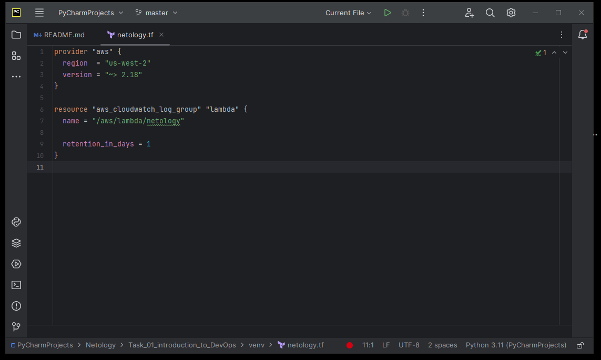
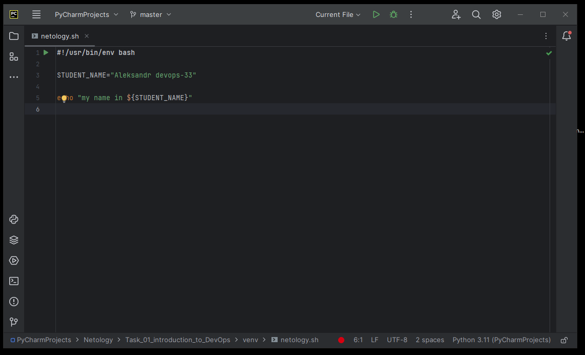
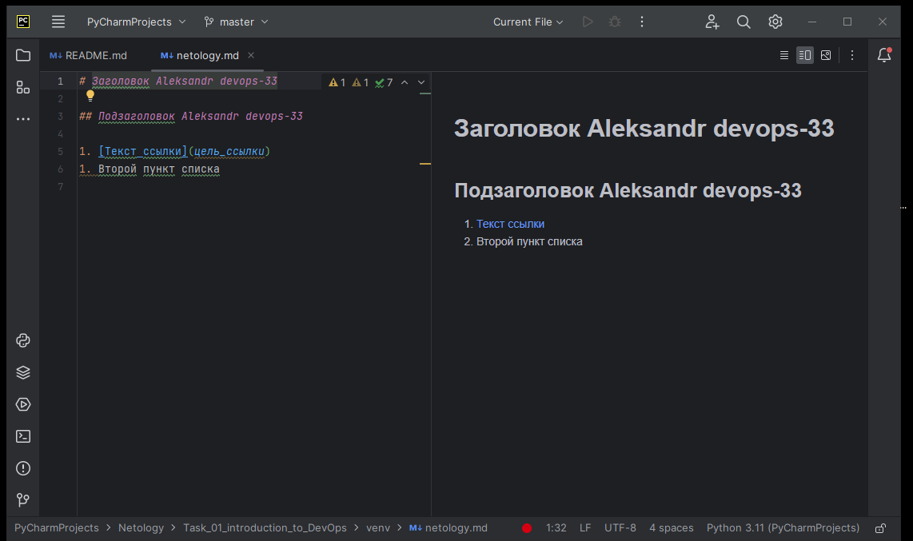
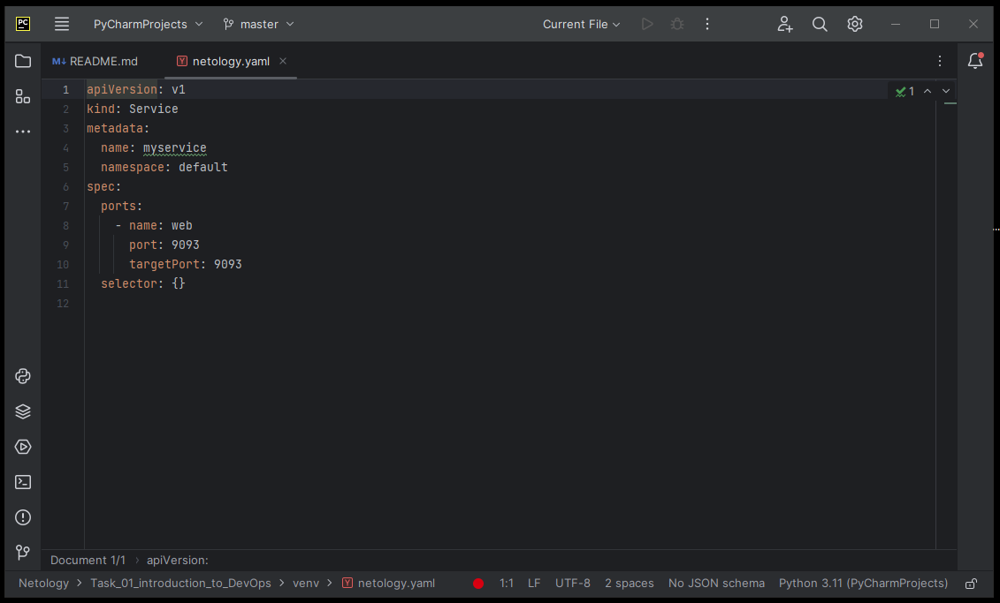
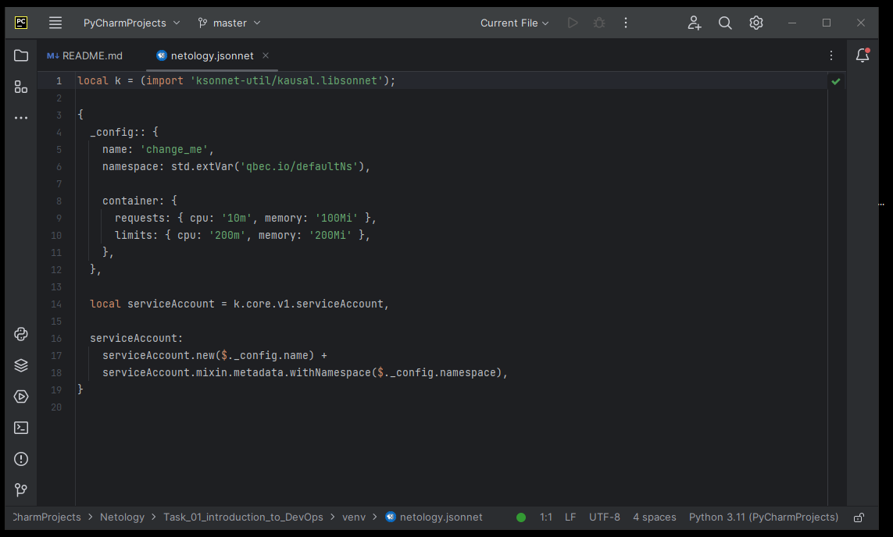

# Домашнее задание к занятию «Введение в DevOps»

Домашнее задание выполните в файле README.md в своём репозитории на GitHub или в Google Doc.

     
## Задание 1. Подготовка рабочей среды
 

### Подсветка синтаксиса работает

* Terraform: 
* Bash: 
* Markdown: 
* Yaml: 
* Jsonnet: 

